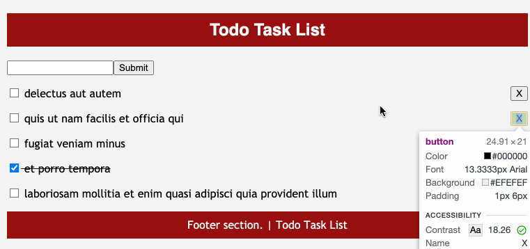

# Task List Application []()
React Experiment - ( Project 01 )
To Do App to practice the React Axios and CRUD operations.

### Application Overview -


### Dependencies -
ReactJS, Axios and JSON placeholder Data

### Initialization -
After cloning the project to local path to run the application, follow the below steps.
```
To Run the applicatin -
git clone 'https://github.com/mnaresh2012/react-to-do-app.git' - to copy the project to local
cd projectName - to change to the project folder
npm install - to install all dependencies
npm start - to start the server
```

### Changelog -
> 0.0.1: BETA version

### Licence []()
> The MIT License (MIT)
